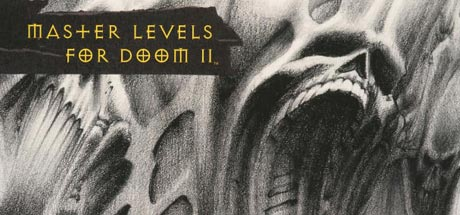

# Masterpack build script utility



The "Master Levels for Doom II" were by far the poorest official release by id Software in it's classic days.

In short it is a grabbag collection of various unstructured, unorganized WAD files, all made by various map authors with a wide variety of styles and design convetions.

Most of the authors involved in the project, made these maps with the intention of them being a part of larger episode overarching a certain theme, with John Anderson, for example, directing a series of 9 total levels theme around the first third of Dante Alighieri's Divine Comedy, Inferno.

However, most of these authors would go on, after the release of the Master Levels release later, free public maps which continued or preceeded the former levels in continuity or level design.

With all this in mind, why should anyone play the official in their original amorphous format? Why should we accept the way things are? Why should we allow people to miss out on the great works of these authors just because the pieces are all over the place?

This script fixes that, all content by the authors past, present and future to the Master Levels is now brought together in a single WAD file for your enjoyment. All 45 relevant (plus 1 bonus) map are now fully playable as 5 separate, organized episodes.

Episodes include:
```
Inferno     -  9 maps, by John "Dr. Sleep" Anderson, Rest In Peace
Titan       -  6 maps, by James "Jim" Flynn, Rest In Peace
Cabal       - 12 maps, by Sverre "Soundblock" Kvernmo
Klietech    - 12 maps, by Christen Klie
Lost Levels -  7 maps, by Tom "Paradox" Mustaine, Theresa Chasar, and Tim Willits
```

# Intructions

In order to use this script correctly you will the following, from your Steam installation of Ultimate Doom and Doom II (keeping in mind, these are the original DOS release version of the IWADs and PWADs, and NOT the Unity port re-release of the same, which have been modfied slightly and will fail the SHA256 checksum):

- Ultimate Doom, `DOOM.WAD`
- Doom II: Hell on Earth, `DOOM2.WAD`
- TNT: Evilution, `TNT.WAD`
- All 20 of the Master Levels for Doom II:
	- Inferno
		- `VIRGIL.WAD`
		- `MINOS.WAD`
		- `NESSUS.WAD`
		- `GERYON.WAD`
		- `VESPERAS.WAD`
	- Titan
		- `MANOR.WAD`
		- `TTRAP.WAD`
	- Cabal
		- `BLODDSEA.WAD`
		- `BLACKTWR.WAD`
		- `MEPHISTO.WAD`
		- `TEETH.WAD`
	- Klietech
		- `SUBSPACE.WAD`
		- `COMBINE.WAD`
		- `FISTULA.WAD`
		- `SUBTERRA.WAD`
		- `CATWALK.WAD`
		- `GARRISON.WAD`
	- Lost Levels
		- `PARADOX.WAD`
		- `ATTACK.WAD`
		- `CANYON.WAD`

# Legalese

Project: `Master Level Masterpack`  
Files: `*`  
Copyright: © 2024 Guilherme Marques Miranda  

Project: `WadSmoosh`  
Files: `masterpack.py`  
Copyright: © 2018 Jean-Paul LeBreton  

Project: `Works of the Masters`  
Files: `base.wad`  
Copyright: © 2020 Jean-Paul LeBreton  

Project: `Omgifol`  
Files: `omg/*`  
Copyright: © 2005 Fredrik Johansson, 2017 Devin Acker  
