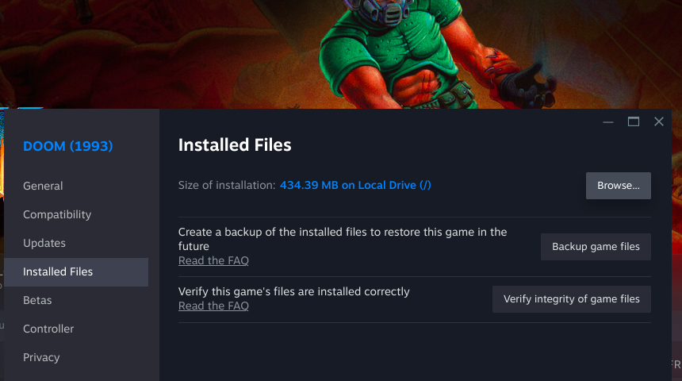
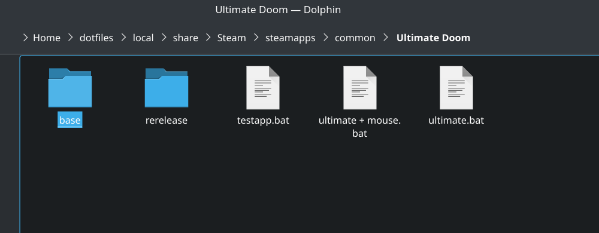
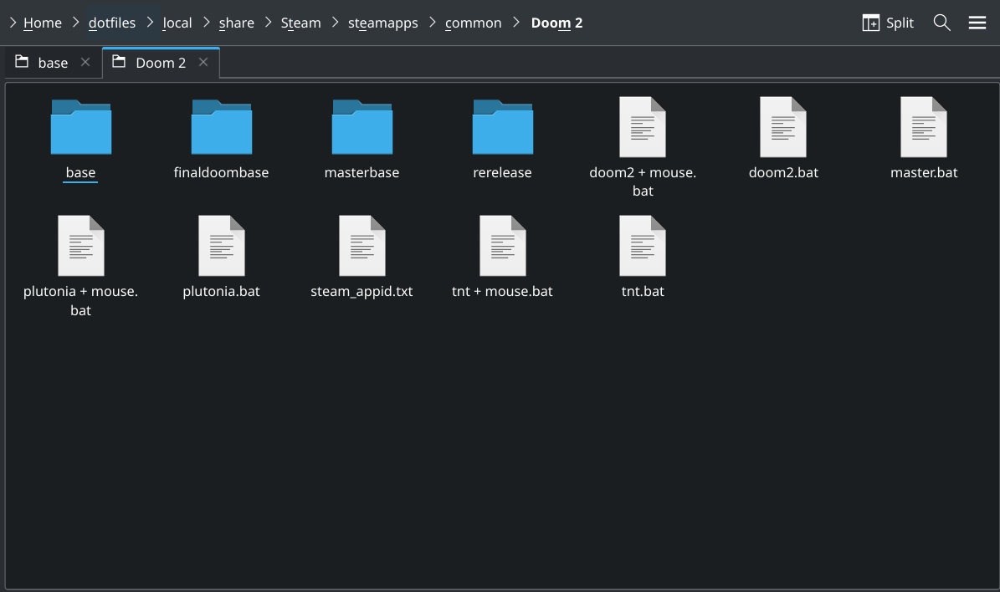
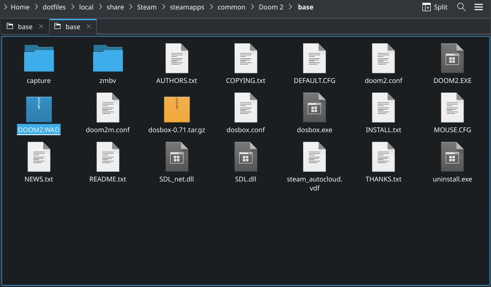

# How to get Doom WAD files from Steam, for dummies

Before procceding, you should have already purchased both `Ultimate Doom` and `Doom II: Hell on Earth`, and installed both games on your machine, via the Steam client.

First: Click on the litle gear icon on the side of the page, then click on "Properties".

Second: Now, a new window will pop-up, going to "Intalled Files" and cliking on "Browse..." will open your file explorer.

Third: You should see the following as the contents of your Ultimate Doom install, the relevant directory here is "base/" as it contains the original release of Ultimate Doom, we'll be ignoring "rerelease/" as it will not work with for our purposes here.

Fourth: You should, now, see `DOOM.WAD` this is the file you are looking for, copy it to a temporary new space, a "New Folder" on your desktop should do fine.

Fifth: Now, close your explorer, returning to your Steam library, go to Doom II and repeat steps 1 and 2, you should now see the installation of Doom II, in here we have more directories to worry about, to begin, we'll concern with "base/", for now.

Sixth: Same as before, but now, with `DOOM2.WAD`, copy the WAD file to the "New Folder" you made on the fourth step.

Seventh: Moving back up one directory, and entering "finaldoombase/", you will see `TNT.WAD`, and now, you know the drill, copy this WAD over as well.

Eighth: Returning to the root Doom II directory, enter the, unfortunately named, "masterbase/".

Nineth: Now go in the last directory, "wads/"

Tenth: Here you are, at the end, wasn't it fun to learn? Now you know your way around Steam installation directories. *Ahem*, grab the 20 WAD files, present in this directory and copy them to the aforementioned folder.

And now, at last, you are done, you now have all needed WAD files for building `masterpack.wad`.
